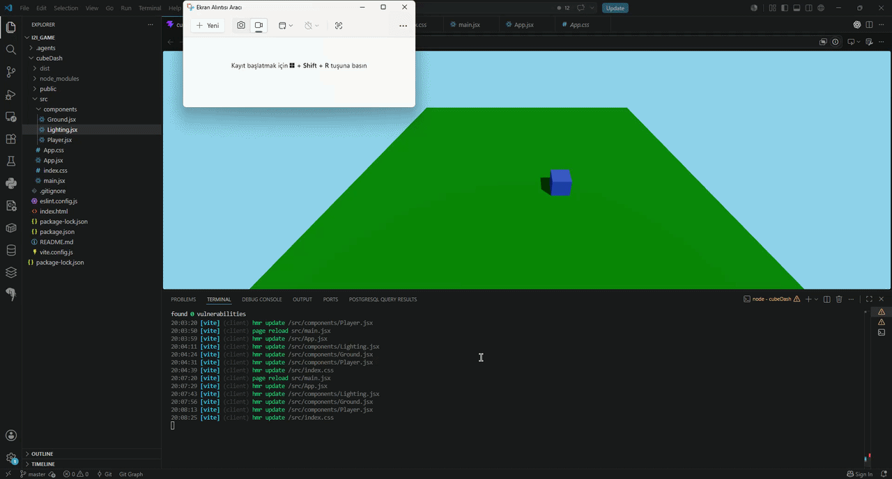
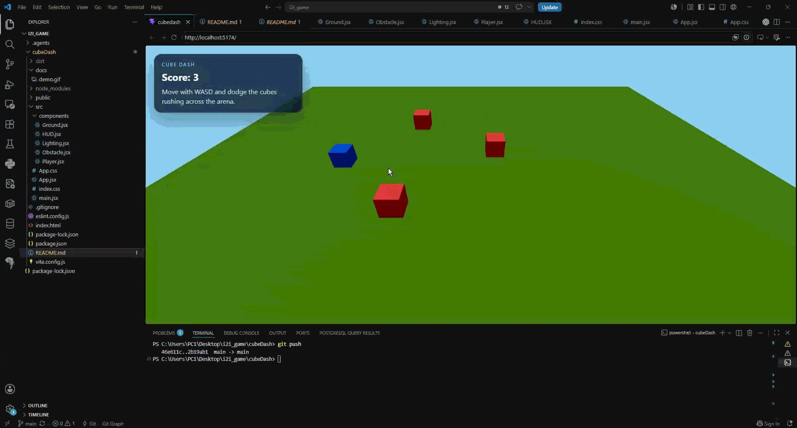

### Cube Dash

Cube Dash is a small React + Three.js dodge game built with Vite and `@react-three/fiber`.

The player controls a blue cube with `W`, `A`, `S`, and `D` and tries to avoid red cubes that rush across the arena. The score increases each time an obstacle crosses the map without hitting the player.

### Demo

stage 1:  Create the base layer and player movements



stage 2:  Randomly generate obstacles that dash towards the camera



### How To Run

Install dependencies:

```bash
npm install
```

Start the development server:

```bash
npm run dev
```

Create a production build:

```bash
npm run build
```

Preview the production build locally:

```bash
npm run preview
```
